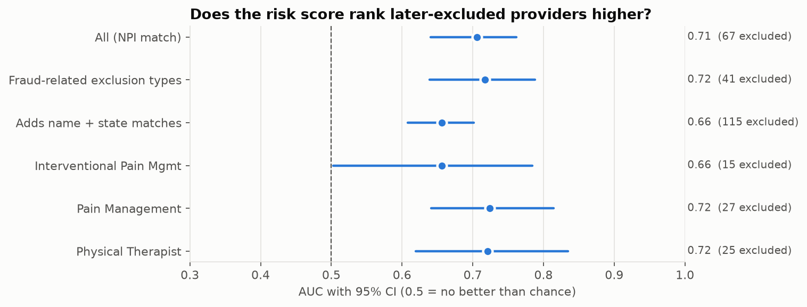
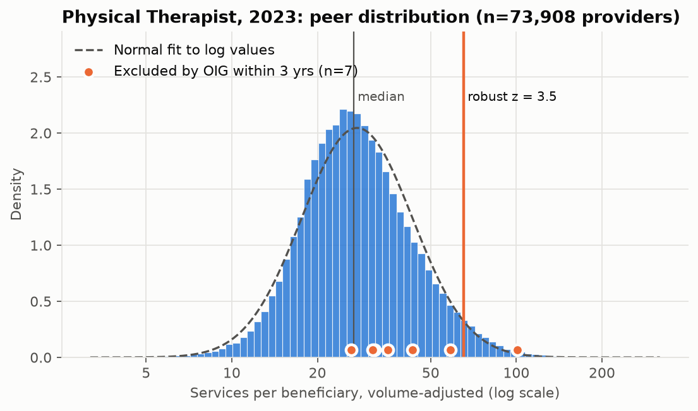
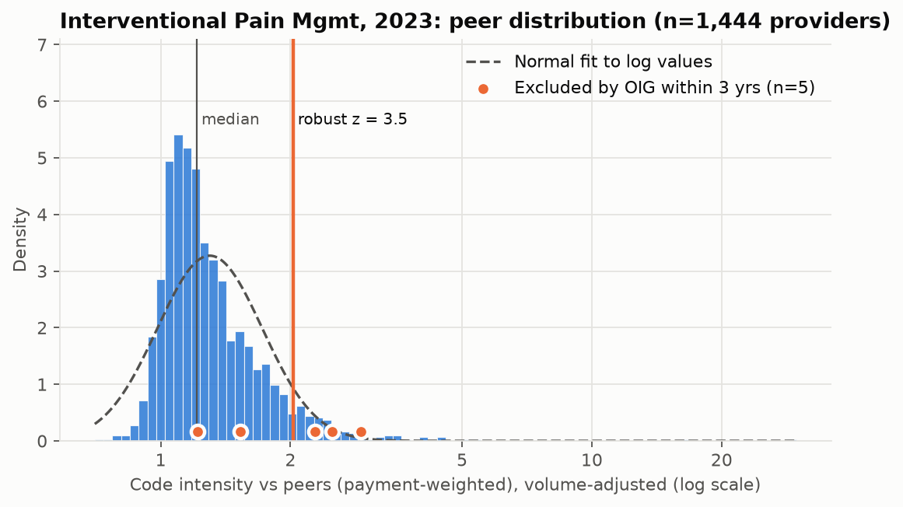

# Medicare Provider Outlier Detection (Payment Integrity / FWA screening)

Flags Medicare providers whose billing or prescribing is statistically unusual compared with
peers in the same specialty, and tests whether those flags **precede OIG exclusions**.

> **Outliers are not fraud.** A high score means a provider is worth a closer look, not that
> anything improper happened. Legitimate reasons include specialized case mix and referral patterns.
> Published results should not name individual providers.

## Question
Can peer-benchmarked outlier scores built from public CMS data rank providers so that those
later excluded by HHS-OIG are concentrated at the top?

## Data (all public)
| Source | Grain | Used for |
|---|---|---|
| CMS Medicare Physician & Other Practitioners – by Provider and Service | NPI × HCPCS × place of service × year | E/M level mix, code-level intensity |
| CMS Medicare Physician & Other Practitioners – by Provider | NPI × year | Volume, standardized payment, beneficiary risk score |
| CMS Medicare Part D Prescribers – by Provider | NPI × year | Opioid, long-acting opioid, brand and cost metrics |
| HHS-OIG LEIE (List of Excluded Individuals/Entities) | Exclusion record | Validation labels |
| CMS NCCI Practitioner Services MUE table (Q4 of each year) | HCPCS code | Unit limits per patient per day |

Scope: Interventional Pain Management, Pain Management, and Physical Therapist in Private Practice
(configurable in `config.yaml`); the most recent 4 data years.

## Method
1. **Ingest** – page the data.cms.gov API with a provider-type filter (avoids multi-GB files); LEIE CSV.
2. **Model** – dbt project (`dbt/`): staging → provider-year feature mart. The same models run on DuckDB
   (local) and Snowflake (warehouse), with dbt tests for keys and one row per provider-year.
3. **Adjust for volume** – rates from low-volume providers are noisy, so each metric is shrunk toward
   the peer median with empirical-Bayes (Bühlmann credibility) weights: Var(x | n) = τ² + σ²/n is fit
   by method of moments per peer group, and x̃ = (n·x + k·median) / (n + k) with k = σ²/τ²
   (fitted k values: `reports/real/shrinkage_k.csv`).
4. **Benchmark** – peer group = specialty × year. For each metric: classic z and percentile
   (bell-curve view) and a **robust z** (median / MAD), since claims metrics are heavily right-skewed.
5. **Score** – rule composite (mean of the 3 largest robust z's, flag at > 3.5) + per-group
   **Isolation Forest** for unusual combinations, fit only on metrics the peer group has.
   Final score = 2:1 weighted average of the two within-group percentiles.
   Each provider gets its top three drivers in plain language.
6. **Validate** – label = same-NPI exclusion within 3 years after the data year. Name+state matches
   (LEIE rows with no NPI) are reported only as a sensitivity check. AUC, precision, recall and lift
   in the top 1% / 5%, with 95% CIs from a bootstrap that resamples providers (not provider-years).

| Metric | Why it matters for payment integrity |
|---|---|
| Services per beneficiary | Over-utilization |
| Risk-adjusted standardized payment per beneficiary | Cost outliers after case-mix and geography |
| Share of level 4–5 / level 5 office visits | Upcoding |
| Code intensity index / most extreme code | Excessive units of specific procedures |
| Timed (15-min) units per patient-day | Billing more therapy units than a session supports (8-minute rule) |
| Service days per beneficiary | Excess visits per patient |
| Concentration of payment in few codes | Billing narrowed to a few high-yield codes |
| Share of passive / unattended modalities | Low-value services (e.g. unattended e-stim, hot packs) |
| Units per patient-day vs NCCI MUE (worst code) | Billing at or above CMS's per-day unit limit; an average above the MUE means some days exceeded it |
| Opioid share, long-acting share | Controlled-substance prescribing risk |
| Brand share, Part D cost per beneficiary | Costly prescribing patterns |

## Run it
Requires [uv](https://docs.astral.sh/uv/).
```bash
uv sync                          # creates .venv with the locked dependencies (Python 3.12)

uv run fwa all --synthetic       # offline smoke test on generated data (~30 s)
uv run fwa all                   # real data: download -> load -> transform -> score -> validate
```
Dashboard (after `validate` has written `data/out/dashboard.parquet`):
```bash
uv run streamlit run dashboard/app.py                                   # real data
FWA_DATA_DIR=data_synthetic uv run streamlit run dashboard/app.py       # synthetic
```
Providers appear under a pseudonymous ID. `FWA_SHOW_IDENTIFIERS=1` shows NPI and name for local use only.

Steps can be run individually: `uv run fwa download` (or `load`, `transform`, `score`, `validate`, `charts`).
Outputs: `data/fwa.duckdb`, `data/out/*.parquet`, `reports/real/validation.json`, `reports/real/figures/*.png`.

## Snowflake

The same dbt models build the warehouse version in Snowflake; Python scoring reads the Snowflake features and writes
scores back, and a reconciliation checks Snowflake against DuckDB column by column.

```
DuckDB raw.*  --parquet-->  @RAW.FWA_STAGE  --COPY INTO-->  RAW.*  --dbt build-->  STG.*, MART.*
MART.PROVIDER_FEATURES  -->  fwa score (Python)  -->  MART.PROVIDER_SCORES
```

One-time setup (key-pair auth: Snowflake no longer allows passwords for service users):
```bash
uv sync
uv run fwa sf-keygen            # writes ~/.snowflake/fwa_rsa_key.p8, prints the public key
# paste the key into snowflake/setup.sql and run that file in a Snowsight worksheet as ACCOUNTADMIN
```
Then:
```bash
uv run fwa sf-all               # sf-load -> sf-transform (dbt) -> sf-score -> sf-reconcile
```
User, role, warehouse and database are in `config.yaml` (`snowflake:`). Put your account identifier in a git-ignored
`config.local.yaml` (`snowflake: {account: <orgname-account>}`) or the `SNOWFLAKE_ACCOUNT` variable; keys stay in `~/.snowflake/`.
Output: `reports/real/reconciliation.md`. Latest run: all 594,765 provider-years and every feature column match
DuckDB (MATCH); 15/15 dbt models and tests pass in both targets.

## Results
Data years 2016–2024 · 594,765 provider-years · 129,870 providers · 67 providers excluded by OIG
(same-NPI match) within 3 years of a scored year. 95% confidence intervals resample providers.

| | AUC | Top 5% lift | Top 5% recall |
|---|---|---|---|
| **All specialties (NPI match)** | **0.71 [0.64–0.76]** | **3.4× [2.1–5.1]** | 17% [11–25%] |
| Fraud-related exclusion types (1128a1, a3, b7) | 0.72 [0.64–0.79] | 3.6× [2.1–5.5] | 18% |
| Sensitivity: adds name + state matches | 0.66 [0.61–0.70] | 2.9× [1.9–4.0] | 15% |
| Interventional Pain Management (15 excluded) | 0.66 [0.50–0.78] | 2.6× [0.0–5.8] | 13% |
| Pain Management (27 excluded) | 0.72 [0.64–0.81] | 2.0× [0.5–4.0] | 10% |
| Physical Therapist (25 excluded) | 0.72 [0.62–0.83] | 5.9× [2.9–9.3] | 29% |

**Findings**
- The score ranks providers later excluded by OIG well above chance: AUC 0.71 (CI 0.64–0.76), stable across
  data years (2016 0.75, 2017 0.69, 2018 0.62, 2019 0.73, 2020 0.83, 2021 0.63, 2022 0.70, 2023 0.71, 2024 0.64). Reviewing the top 5% of provider-years reaches 17% of later exclusions (3.4× the random rate); the top 20%, 53%.
- It holds for the fraud-related exclusion types alone (AUC 0.72).
- Physical therapists have the strongest top-of-list concentration (5.9× in the top 5%). Differences between
  specialties seen on 2021–24 alone (Interventional Pain Management highest) did not hold with more data: they were noise.
- Utilization drives the signal: services per beneficiary, code-level intensity, units per patient-day and MUE headroom.
- Name + state matching adds noise (AUC 0.66), so NPI matching is the primary label.







**How to read this.** With 67 positive providers, intervals are still wide; the top-1% lift is not
reported because it rests on a handful of providers. Most flagged providers are never excluded,
and many will have legitimate explanations. The score prioritises review; it does not identify fraud.

## Experiments

Ideas from two papers are tested against a **frozen baseline** instead of being merged into the score:
Johnson & Khoshgoftaar (2023), *Data-Centric AI for Healthcare Fraud Detection*, SN Computer Science 4:389, and
Hamid et al. (2024), *Healthcare insurance fraud detection using data mining*, BMC Med Inform Decis Mak 24:112.
Each experiment was specified before its results were seen (`fwa/experiments.py`). A change is adopted only if it beats the
baseline within specialty with non-overlapping intervals, or clearly on dollars.

```bash
uv sync                                  # installs all groups (dev, experiments, snowflake)
uv run fwa experiments --freeze          # freeze current scores as the baseline, run all, write reports/real/experiments.md
uv run fwa experiments --only C          # rerun one experiment
```

| Run | Idea (source) | What changes |
|---|---|---|
| A1 / A2 | Supervised XGBoost with SHAP (J&K) | Same metrics + case-mix; CV grouped by NPI (A1); plus train on 2021–22, test on 2023–24 (A2) |
| B | Summary-by-provider beneficiary features (J&K) | Metrics residualized on patient age, dual eligibility, chronic conditions, risk score |
| C | Other unsupervised detectors (Hamid) | ECOD or CBLOF in place of Isolation Forest |
| D1–D4 | Replication ladder (J&K) | Their label and "aggregated-enriched" features, then one change at a time toward this project's evaluation |
| all | Cost-based evaluation (Hamid) | Adds top-5% **dollar recall**: share of later-excluded providers' payments in the top 5% |

Also adopted from J&K as a data fix: a **cumulative exclusion list** (archived LEIE snapshots + OIG monthly supplements),
so providers who were excluded and later reinstated still count as positives (`validation.leie_source`).

**Results, data years 2016–2024** (67 later-excluded providers; frozen baseline of Sep 30, 2026).

| Run | AUC | Top 5% lift | Top 5% recall | Top 5% $ recall |
|---|---|---|---|---|
| **Baseline** (rules 2 : IF 1) | **0.70** [0.64–0.75] | **3.4×** [1.9–4.9] | 17% [9–24%] | 21% [8–37%] |
| Baseline, rules only | 0.71 [0.65–0.76] | 3.3× [1.9–4.9] | 16% | 12% |
| Baseline, Isolation Forest only | 0.67 [0.59–0.72] | 3.6× [2.0–5.3] | 18% | 31% |
| A1 XGBoost, NPI-grouped CV | 0.65 [0.58–0.71] | 2.6× | 13% | 8% |
| A2 XGBoost, grouped + trained ≤2019, tested 2020–24 | 0.67 [0.58–0.75] | 4.0× [1.6–6.7] | 20% | 18% |
| B Case-mix peers | 0.67 [0.61–0.72] | 2.8× | 14% | 21% |
| C Rules + ECOD | 0.70 [0.63–0.76] | 3.4× | 17% | 21% |
| C Rules + CBLOF | 0.72 [0.65–0.76] | 3.6× [2.0–5.3] | 18% | 23% |
| C CBLOF alone | 0.68 [0.62–0.74] | 3.4× | 17% | 27% |

| Replication step (Johnson & Khoshgoftaar setup → this project's) | Positive providers | AUC |
|---|---|---|
| D1 Their label, all specialties pooled, row-level CV | 87 | 0.93 [0.91–0.95] |
| D2 … CV grouped by NPI | 87 | 0.82 [0.77–0.88] |
| D3 … AUC within specialty-year | 87 | 0.66 [0.60–0.72] |
| D4 … our future-exclusion label | 66 | 0.62 [0.55–0.68] |

**Pre-registered CBLOF test (held-out years 2016–2019, 34 excluded providers):** CBLOF minus baseline, AUC
+0.009 [−0.013 to +0.032], top-5% dollar recall −0.008 [−0.069 to +0.042]. Rule not met: **Isolation Forest stays.**
CBLOF's edge on 2021–24 did not replicate on independent years.

Decisions and readings:
- **Keep the baseline.** No variant beats it with non-overlapping intervals, and the one candidate failed its
  pre-registered test.
- **Supervised learning improves with labels but still trails.** XGBoost went from ~0.5 (29 positives) to 0.65–0.67
  (67 positives), below the unsupervised baseline. With richer labels (audit outcomes, or all specialties) a
  supervised layer is the natural next step.
- **The published-style result is mostly leakage and pooling.** Their setup reaches 0.93 on this data; keeping each
  provider on one side of the split drops it to 0.82, ranking within specialty to 0.66, and predicting future
  exclusions to 0.62. The unsupervised baseline keeps 0.70 under the same strict test.
- **Rules and detectors find different providers:** rules capture 12% of excluded dollars in the top 5%, Isolation
  Forest 31%; the combination keeps rules' ranking and part of the detectors' dollar reach.
- **Case-mix residualizing (B)** lowers AUC (0.67); not adopted.
- **Labels:** 11 archived LEIE snapshots (2016–2026) plus 12 months of OIG supplements.
- **MUE:** CMS's archive starts in 2020, so data years 2016–19 use the 2020 table.

### Pre-registered confirmatory test (written Sep 30, 2026, before 2016–2020 data was downloaded)

CBLOF looked better than Isolation Forest in all three 2021–24 runs, but those runs share labels. The test uses the
new, held-out data years **2016–2019** only: CBLOF replaces Isolation Forest if the paired bootstrap difference
(CBLOF combined minus baseline, 1,000 provider resamples) has an AUC interval above 0, or a top-5% dollar-recall
interval above 0 with an AUC difference of at least 0. Otherwise Isolation Forest stays. Code: `CONFIRM_YEARS` and the
`confirm` step in `fwa/experiments.py`; output in `reports/real/experiments.md`.

## Limitations
- The current LEIE drops reinstated providers. The cumulative history (yearly Internet Archive snapshots + OIG's last
  12 months of supplements) restores them, but exclusions that start and end between two snapshots can still be missed.
- Exclusion lags misconduct by years and captures only a fraction of FWA, so it is a noisy label.
- CMS suppresses cells with fewer than 11 beneficiaries; small providers are excluded.
- Name+state matching can produce false matches; it is reported only as a sensitivity check.
- Peer groups are national (specialty × year); state or practice-setting peers may change results.
- Raw scores are not comparable across specialties (exclusion rates differ ~20×), so validation
  uses within-specialty percentiles only.
- Positives are few (67 providers over 2016–2024), so intervals are still wide; audit outcomes would be a far richer label.

## Roadmap
- [x] Ingestion, DuckDB models, peer scoring, exclusion-based validation, synthetic test data
- [x] Real-data run, bootstrap CIs, results write-up and charts
- [x] Physical-therapy billing metrics
- [x] Extend to data years 2016–2024 (config); pre-registered CBLOF test on held-out 2016–2019
- [x] Results for 2016–2024; CBLOF rejected by the pre-registered test
- [x] Streamlit dashboard (overview, peer distributions, review queue, method)
- [x] Volume-aware scoring (empirical-Bayes shrinkage)
- [x] Snowflake: dbt builds staging and marts in Snowflake; scores written back; reconciled with DuckDB
- [x] NCCI MUE check (units per patient-day vs the practitioner MUE table)
- [ ] Modifier 59/X{EPSU} rates and PTP-bypass patterns (needs claim-line data)

## Data and license

All inputs are public: CMS Medicare Provider Utilization and Payment Data (data.cms.gov), the HHS-OIG LEIE, and the
CMS NCCI MUE tables. Raw data, databases and provider-level outputs are not committed; `uv run fwa all` rebuilds them.
Code is MIT-licensed (`LICENSE`). Results describe statistical outliers, not findings of fraud.
